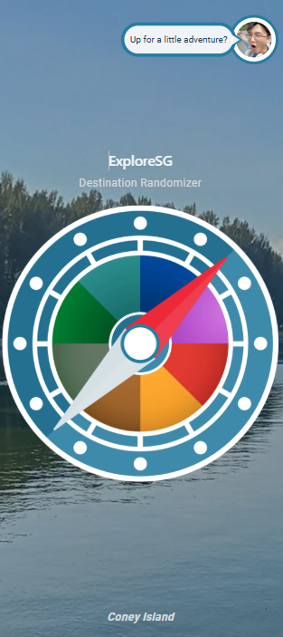
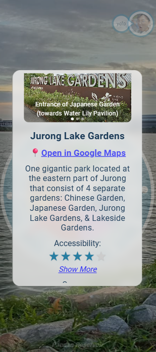
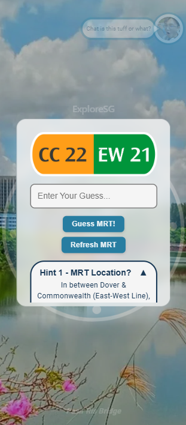
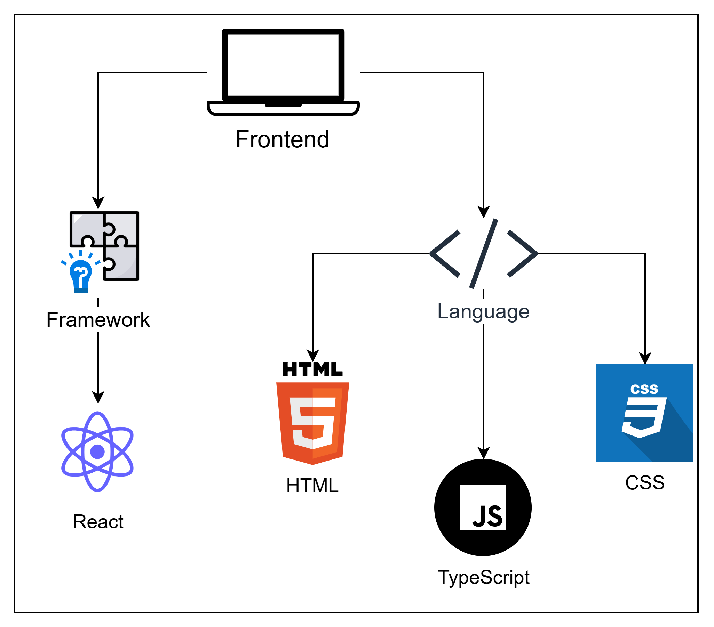

# 🧭 ExploreSG (Demo V1) 🌏
**Destination Randomizer for Singapore**

[](https://explore-sg.vercel.app/)

_Don't know where to start exploring in Singapore?_

[ExploreSG](https://explore-sg.vercel.app/) is a self-made web project that helps users discover different places in Singapore.

***Fun fact: All the places listed in the application are places visited by the author at least once! :)***

## ✨ Features

- **Randomizer Compass** → Spin to get a random destination.
- **Destination Information** → Map location, curated photos, reviews and remarks.[^1][^2]
- **Guess The MRT** → A playable minigame about Singapore's MRT
- **Responsive UI** → Optimized for mobile and desktop devices.

[^1]: All the photos, reviews, and remarks are curated by the author.
[^2]: Feature still in development, hence some reviews are marked as "in progress".





## 🛠️ Tech Stack

- **React + TypeScript** → Frontend architecture.  
> [!NOTE]  
> Used JSON for mock data, backend to be implemented in later versions.

## ⚙️ Deployment & Tools

- **Cloudinary** → Image compression/storage.
- **Vercel** → Hosting & analytics.
- **Affinity Designer** → 2D asset creation.

## 📦 Installation
Clone the repo and install dependencies:

```bash
git clone https://github.com/your-username/exploresg.git
cd exploresg
npm install
```

Run locally:

```bash
npm run frontend
```